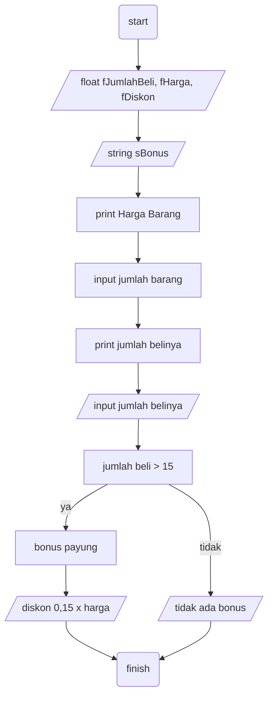

```mermaid
flowchart TD;
A(start)--> B[/float fJumlahBeli, fHarga, fDiskon/];
B --> C[/string sBonus/];
C --> D[print Harga Barang];
D --> E[input jumlah barang];
E --> F[print jumlah belinya];
F --> G[/input jumlah belinya/];
G --> H[jumlah beli > 15];
H --ya--> I[bonus payung];
I --> J[/diskon 0,15 x harga/];
H --tidak--> K[/tidak ada bonus/];
J --> 0(finish);
K --> 0;
```